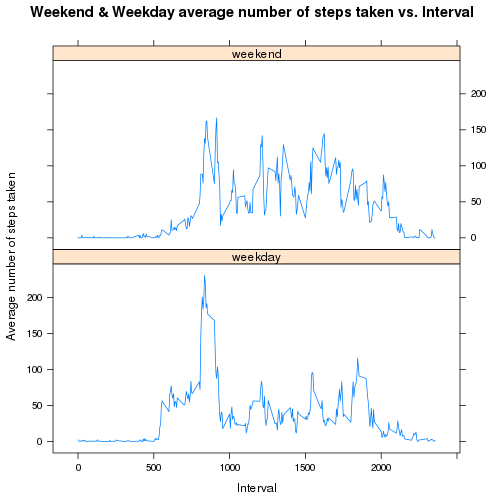

## Loading and preprocessing the data


```r
# Set data dir
data.directory <- "./data"

# Set zip archive data file name
archive.file.name <- "activity.zip"

# Set path/to/zip archive data file 
archive.data.file <- file.path(data.directory, archive.file.name)

# Extract zip archive data file
unzip(archive.data.file, exdir = data.directory)

# Set csv data file name
csv.file.name <- "activity.csv"

# Set path/to/csv data file 
csv.data.file <- file.path(data.directory, csv.file.name)

# Read csv data file
my.frame <- read.csv(file = csv.data.file, 
                     stringsAsFactors = FALSE, 
                     colClasses = c("integer", "Date", "integer")
            )
```

## What is mean total number of steps taken per day?


```r
# Compute total steps by day
require(dplyr)
total.steps <- summarise(group_by(my.frame, date), 
                         total = sum(steps, na.rm = TRUE)
               )

# Alternatively, use:
# total.steps <- my.frame %>%
#                 group_by(date) %>%
#                 summarise(total = sum(steps, na.rm = TRUE))

# Make a histogram of total steps by day
hist(total.steps$total, 
     main = "Total steps taken per day", 
     xlab = "Total steps taken")
```

 

```r
# Compute mean and median total number of steps by day
mean.steps   <- mean(total.steps$total, na.rm = TRUE)
mean.steps
```

```
## [1] 9354.23
```

```r
median.steps <- median(total.steps$total, na.rm = TRUE)
median.steps
```

```
## [1] 10395
```

## What is the average daily activity pattern?


```r
# Compute average number of steps per interval
require(dplyr)
interval.aves <- my.frame %>%
                   group_by(interval) %>%
                   summarise(ave.steps = mean(steps, na.rm = TRUE))

# Make a time series plot of interval vs. average number of steps
plot(ave.steps ~ interval, data = interval.aves, type = "l",
     main = "Average number of steps taken vs. Interval",
     xlab = "Interval", ylab = "Average number of steps taken"
     )
```

 

```r
# Interval containing max average number of steps
interval.aves[interval.aves$ave.steps == max(interval.aves$ave.steps), "interval"]
```

```
## Source: local data frame [1 x 1]
## 
##   interval
## 1      835
```

```r
# Alternatively, do:
# subset(interval.aves, 
#           interval.aves$ave.steps == max(interval.aves$ave.steps), 
#           interval)
#
# -or,
# max.interval <- which(interval.aves$ave.steps == max(interval.aves$ave.steps))
# interval.aves[max.interval, "interval"]
```

## Imputing missing values


```r
# Compute total number of rows equal to NA
sum(is.na(my.frame$steps))
```

```
## [1] 2304
```

```r
# Set interval NAs to mean number of steps for that interval
require(dplyr)
imputed.frame <- my.frame %>%
                   group_by(interval) %>%
                   mutate(steps = ifelse(is.na(steps), 
                                    mean(steps, na.rm = TRUE), 
                                    steps)
                   )

# Compute total steps by day
require(dplyr)
total.imputed.steps <- summarise(group_by(imputed.frame, date), 
                                 total = sum(steps, na.rm = TRUE))

# Make a histogram of total steps by day
hist(total.imputed.steps$total,
     main = "Imputed total steps taken per day", 
     xlab = "Total steps taken")
```

 

```r
# Compute mean and median total number of steps by day
mean.steps   <- mean(total.imputed.steps$total, na.rm = TRUE)
mean.steps
```

```
## [1] 10766.19
```

```r
median.steps <- median(total.imputed.steps$total, na.rm = TRUE)
median.steps
```

```
## [1] 10766.19
```

## Are there differences in activity patterns between weekdays and weekends?


```r
# Create new factor variable
imputed.frame$day.of.week <- factor(ifelse(weekdays(imputed.frame$date) == "Saturday" |
                                           weekdays(imputed.frame$date) == "Sunday", "weekend", "weekday"),
                                    levels = c("weekend", "weekday"))

# Alternatively do:
# transform(imputed.frame,
#          day.of.week <- factor(ifelse(weekdays(date) == "Saturday" |
#                                       weekdays(date) == "Sunday", "weekend", "weekday"),
#                                levels = c("weekend", "weekday")))

# The dplyr way:
# mutate(imputed.frame,
#   day.of.week <- factor(ifelse(weekdays(date) == "Saturday" |
#                                weekdays(date) == "Sunday", "weekend", "weekday"),
#                         levels = c("weekend", "weekday"))
# )     

# Compute average number of steps per interval
# Weekday:
require(dplyr)
weekday.interval.aves <- imputed.frame %>%
                           filter(day.of.week == "weekday") %>%
                           group_by(interval) %>%
                           summarise(ave.steps = mean(steps, na.rm = TRUE)
                           ) %>%
                           mutate(day.of.week = "weekday")
    
# Weekend:
require(dplyr)
weekend.interval.aves <- imputed.frame %>%
                           filter(day.of.week == "weekend") %>%
                           group_by(interval) %>%
                           summarise(ave.steps = mean(steps, na.rm = TRUE)
                           ) %>%
                           mutate(day.of.week = "weekend")

# Merge weekday and weekend data sets
weekday.weekend.interval.aves <- rbind(weekday.interval.aves, weekend.interval.aves)

# Make a time series plot of interval vs. average number of steps for weekend and weekday
require(lattice)
xyplot(ave.steps ~ interval | factor(day.of.week,
                                     levels = c("weekday", "weekend")),
       data = weekday.weekend.interval.aves,
       type = "l",
       layout = c(1, 2),
       main = "Weekend & Weekday average number of steps taken vs. Interval",
       xlab = "Interval",
       ylab = "Average number of steps taken"
       )
```

 
